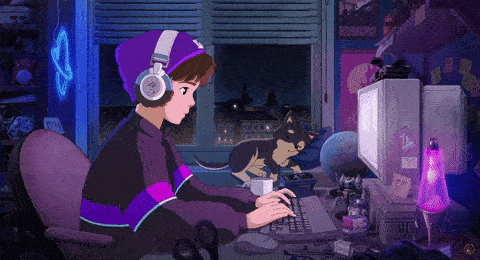

  

   

  

<h3 align="center">My interests</h3>

   

🔭 I’m currently learning <a href="https://www.w3schools.com/cpp/">C++</a>

🌱 I’m currently working on <a href="https://github.com/AbolDev/File-Manager">File-Manager</a>

💬 Ask me about <strong>Python, Flask, TeleBot</strong>

📫 How to reach me: <strong>abaqry8686@gmail.com</strong>

😄 Pronouns: <strong>He/Him</strong>

 
<h3 align="center">Languages and Tools:</h3>

  
   
   
   
   

 

  

   

  

  
  
  
  
  

<h3 align="center">Connect with Me</h3>

  
<!--   &nbsp;&nbsp;&nbsp; -->
  

